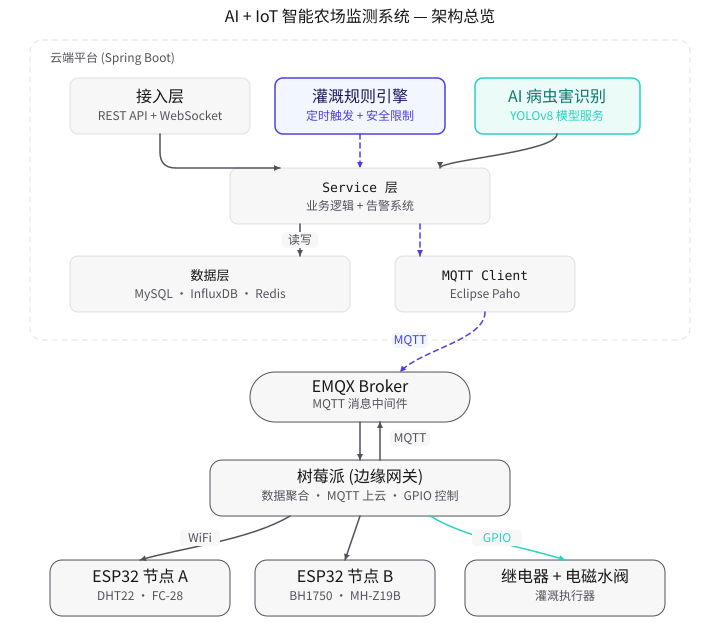

# Smart Farm System - 智能农场监测系统

> 基于 Spring Boot 3.2 + AI + IoT 的智能农场监测平台，通过树莓派+ESP32 边缘节点采集多传感器数据，MQTT 协议上云，Java 后端做平台管控、自动灌溉和 AI 病虫害识别。

## 项目简介

Smart Farm System 是一个面向智慧农业场景的 IoT + AI 全栈监测平台。系统以 **树莓派** 作为边缘网关，连接多个 **ESP32** 采集节点，实时采集空气温湿度（DHT22）、土壤湿度（FC-28）、光照强度（BH1750）、CO2 浓度（MH-Z19B）等多维传感器数据。数据通过 **MQTT 协议** 上报到云端平台，平台基于 **InfluxDB** 存储时序数据、**MySQL** 管理业务数据，通过 **WebSocket** 实时推送给前端看板。系统内置**自动灌溉引擎**（规则触发 + 安全限制 + MQTT 控制闭环）和 **AI 病虫害识别**模块（对接 YOLOv8 模型服务），形成"感知→决策→执行→反馈"的完整闭环。

---

## 系统架构图



> **图例**：紫色边框 = 核心焦点模块（灌溉规则引擎）；紫色虚线 = 主数据流路径（MQTT 上云 + 指令下发）；青色实线 = 控制闭环（GPIO → 继电器 → 水阀）；灰色实线 = 常规依赖调用。

**数据流向（控制闭环）：**

```
传感器采集 → ESP32 节点 → 树莓派网关(聚合) → MQTT上云 → 平台处理
                                                            ↓
  水阀控制 ← 继电器 ← 树莓派GPIO ← MQTT指令下发 ← 灌溉规则引擎(定时检查)
```

---

## 硬件 BOM 清单

| 序号 | 组件 | 型号 | 用途 | 参考价格(元) | 数量 |
|------|------|------|------|-------------|------|
| 1 | 主控板 | 树莓派 4B 4GB | 边缘网关，聚合数据+MQTT上云+GPIO控制 | 280 | 1 |
| 2 | 采集节点 | ESP32 DevKit V1 | 传感器数据采集+WiFi上传 | 25 | 2 |
| 3 | 温湿度传感器 | DHT22 (AM2302) | 空气温度/湿度采集 | 18 | 2 |
| 4 | 土壤湿度传感器 | FC-28 (YL-38) | 土壤湿度采集 | 8 | 2 |
| 5 | 光照传感器 | BH1750FVI | 光照强度采集 | 12 | 2 |
| 6 | CO2传感器 | MH-Z19B | CO2浓度采集 | 65 | 1 |
| 7 | 继电器模块 | 5V 单路继电器 | 控制电磁水阀开关 | 8 | 1 |
| 8 | 电磁水阀 | 12V DN15 常闭型 | 灌溉水管控制 | 25 | 1 |
| 9 | 电源适配器 | 12V 2A | 水阀+继电器供电 | 20 | 1 |
| 10 | MicroSD卡 | 32GB Class10 | 树莓派系统存储 | 25 | 1 |
| 11 | 杜邦线 | 母对母/公对母 各40条 | 接线 | 10 | 1套 |
| 12 | 电源 | 5V 3A USB-C | 树莓派供电 | 25 | 1 |
| 13 | 面包板 | 830孔 | 原型搭建 | 8 | 1 |
| **合计** | | | | **约 ¥780** | |

> 价格仅供参考，实际以采购渠道为准。总成本控制在 800 元以内。

---

## 核心功能

| 模块 | 功能说明 |
|------|---------|
| 传感器数据采集 | ESP32 多节点采集温湿度/土壤湿度/光照/CO2，树莓派聚合后 MQTT 上云，写入 InfluxDB 时序库 + Redis 缓存 |
| 实时数据看板 | WebSocket 实时推送传感器数据，24小时趋势图，灌溉/告警/病害统计 |
| 自动灌溉引擎 | 规则触发（土壤湿度<阈值 && 时段允许），安全限制（最大时长/日次数/雨天跳过），MQTT 下发控制指令 |
| AI 病虫害识别 | 上传图片调用 YOLOv8 模型识别病害，返回类型+置信度+处理建议，支持批量识别 |
| 多级告警系统 | 传感器超阈值/设备离线/灌溉异常告警，WebSocket 实时推送 + 数据库记录，Redis 防重复 |
| 数据聚合 | 定时每小时聚合传感器数据（均值/最大/最小），降低查询扫描量 |
| API 文档 | Knife4j (Swagger) 自动生成接口文档，访问 `/doc.html` |

---

## 技术栈

| 类别 | 技术 | 版本 | 说明 |
|------|------|------|------|
| 语言 | Java | 17 | LTS 版本 |
| 框架 | Spring Boot | 3.2.5 | 主框架 |
| ORM | MyBatis-Plus | 3.5.7 | MySQL 数据访问 |
| 时序数据库 | InfluxDB | 2.7 | 传感器时序数据存储 |
| 业务数据库 | MySQL | 8.0 | 业务数据存储 |
| 缓存 | Redis | 7 | 最新值缓存 + 限流 + 告警去重 |
| 消息协议 | MQTT (Eclipse Paho) | 1.2.5 | 边缘设备通信 |
| MQTT Broker | EMQX | 5.4 | MQTT 消息中间件 |
| 实时推送 | WebSocket | - | 前端看板数据推送 |
| AI | YOLOv8 + FastAPI | - | 病虫害识别 (HTTP API) |
| API 文档 | Knife4j | 4.4.0 | OpenAPI 3 文档 |
| 工具库 | Lombok / Hutool | - | 简化代码 |
| 边缘节点 | ESP32 + Arduino | - | 传感器采集 |
| 边缘网关 | 树莓派 + Python | - | 数据聚合+MQTT上云+GPIO控制 |

---

## 快速启动

### 前置条件

- JDK 17+
- Maven 3.8+
- Docker & Docker Compose
- （硬件部分）树莓派 4B + ESP32 + 传感器套件

### 1. 克隆项目

```bash
git clone https://github.com/yourusername/smart-farm-system.git
cd smart-farm-system
```

### 2. 启动基础设施 (MySQL + Redis + EMQX + InfluxDB)

```bash
docker-compose up -d
```

等待所有容器启动完成后，可通过以下地址访问：
- MySQL: `localhost:3306` (root/Farm@2024)
- Redis: `localhost:6379` (密码 Farm@2024)
- EMQX Dashboard: `http://localhost:18083` (admin/Farm@2024)
- InfluxDB UI: `http://localhost:8086` (admin/Farm@2024)
- 数据库初始化脚本会自动执行 `src/main/resources/sql/init.sql`

### 3. 编译并启动应用

```bash
# 编译
mvn clean compile

# 启动
mvn spring-boot:run
```

### 4. 访问服务

| 服务 | 地址 |
|------|------|
| API 文档 (Knife4j) | http://localhost:8080/doc.html |
| WebSocket | ws://localhost:8080/ws/farm?farmId=1 |
| 农场列表 API | http://localhost:8080/api/farm/list |
| 看板数据 API | http://localhost:8080/api/dashboard/overview |

### 5. （可选）启动 AI 识别服务

如需启用 AI 病虫害识别，需部署 YOLOv8 服务（参考 [docs/hardware-setup.md](docs/hardware-setup.md)），然后在 `application.yml` 中设置 `ai.disease.enabled: true`。

未启用时系统返回模拟结果，方便开发测试。

### 6. （可选）硬件部署

1. 将 `scripts/esp32_sensor_node.ino` 烧录到 ESP32 开发板
2. 将 `scripts/raspberry_pi_gateway.py` 部署到树莓派
3. 按接线表连接传感器（参考 [docs/hardware-setup.md](docs/hardware-setup.md)）

---

## API 概览

| 模块 | 方法 | 路径 | 说明 |
|------|------|------|------|
| 农场管理 | GET | `/api/farm/list` | 获取所有农场 |
| | GET | `/api/farm/{id}` | 农场详情 |
| | POST | `/api/farm` | 创建农场 |
| | PUT | `/api/farm` | 更新农场 |
| | DELETE | `/api/farm/{id}` | 删除农场 |
| 地块管理 | GET | `/api/farm/{farmId}/fields` | 地块列表 |
| | POST | `/api/farm/field` | 创建地块 |
| 传感器 | GET | `/api/sensor/list/{farmId}` | 传感器设备列表 |
| | GET | `/api/sensor/latest/{sensorId}` | 最新传感器数据 |
| | GET | `/api/sensor/latest/farm/{farmId}` | 农场所有传感器最新值 |
| | GET | `/api/sensor/history` | 历史趋势 (InfluxDB) |
| | GET | `/api/sensor/trend/24h/{farmId}` | 24小时趋势 |
| 灌溉控制 | POST | `/api/irrigation/trigger` | 手动触发灌溉 |
| | GET | `/api/irrigation/logs` | 灌溉日志 |
| | GET | `/api/irrigation/stats/weekly/{farmId}` | 本周灌溉统计 |
| | GET | `/api/irrigation/rules/{farmId}` | 灌溉规则列表 |
| | POST | `/api/irrigation/rules` | 创建灌溉规则 |
| | PUT | `/api/irrigation/rules` | 更新灌溉规则 |
| | DELETE | `/api/irrigation/rules/{id}` | 删除灌溉规则 |
| 病害识别 | POST | `/api/disease/detect` | AI 病虫害识别 |
| | POST | `/api/disease/batch-detect` | 批量识别 |
| | GET | `/api/disease/history` | 识别历史 |
| 看板 | POST | `/api/dashboard/overview` | 看板聚合数据 |
| | GET | `/api/dashboard/trend` | 传感器趋势 |
| 告警 | GET | `/api/alarm/list` | 告警列表 |
| | GET | `/api/alarm/recent/{farmId}` | 最近告警 |
| | GET | `/api/alarm/count/today/{farmId}` | 今日告警数 |
| | PUT | `/api/alarm/handle/{id}` | 处理告警 |

---

## MQTT Topic 规划表

| Topic 模板 | 方向 | 说明 |
|------------|------|------|
| `farm/{farmId}/sensor/{sensorId}/data` | 上行 | 传感器数据上报 (ESP32→网关→平台) |
| `farm/{farmId}/control/req` | 下行 | 控制指令下发 (平台→网关→继电器) |
| `farm/{farmId}/control/resp` | 上行 | 设备控制回复 (网关→平台) |
| `farm/{farmId}/device/status` | 上行 | 设备心跳/状态 (网关→平台) |
| `farm/{farmId}/config/req` | 下行 | 设备配置更新 (平台→网关) |

### 传感器数据上报格式示例

```json
{
  "farmId": 1,
  "fieldId": 1,
  "sensorId": "ESP32-A01",
  "timestamp": 1716000000000,
  "data": {
    "temperature": 28.5,
    "humidity": 65.0,
    "soil_moisture": 35.2,
    "light": 12000,
    "co2": 450
  },
  "battery": 3.7
}
```

### 灌溉控制指令示例 (下行)

```json
{
  "commandId": "IRR-1716000000000-a1b2c3d4",
  "fieldId": 1,
  "valveDeviceId": "RELAY-01",
  "action": "OPEN",
  "duration": 600,
  "timestamp": 1716000000000
}
```

### 设备控制回复示例 (上行)

```json
{
  "commandId": "IRR-1716000000000-a1b2c3d4",
  "success": true,
  "actualDuration": 598,
  "waterUsage": 12.5,
  "message": "灌溉执行完成"
}
```

---

## 自动灌溉规则配置示例

```json
{
  "farmId": 1,
  "fieldId": 1,
  "name": "A区1号番茄灌溉规则",
  "soilMoistureThreshold": 25.0,
  "targetSoilMoisture": 60.0,
  "allowedStart": "06:00",
  "allowedEnd": "22:00",
  "maxDurationSeconds": 1800,
  "maxDailyCount": 4,
  "skipIfRain": 1,
  "enabled": 1
}
```

**灌溉触发条件（全部满足）：**
1. 当前时间在 `allowedStart` ~ `allowedEnd` 时段内
2. 当天灌溉次数 < `maxDailyCount`
3. 地块无正在进行的灌溉
4. 未下雨（`skipIfRain=1` 时检查天气）
5. 当前土壤湿度 < `soilMoistureThreshold`

**安全限制：**
- 单次灌溉时长不超过 `maxDurationSeconds`
- 每日灌溉次数不超过 `maxDailyCount`
- 同一地块不允许重复触发（有正在进行的灌溉时跳过）
- 雨天可跳过（可配置）

---

## 树莓派 GPIO 接线对照表

| GPIO 引脚 | 连接设备 | 引脚类型 | 说明 |
|-----------|---------|---------|------|
| GPIO 17 (Pin 11) | 继电器 IN | 输出 | 控制继电器开关（水阀） |
| GPIO 22 (Pin 15) | 蜂鸣器 (可选) | 输出 | 告警提示 |
| GPIO 4 (Pin 7) | DHT22 DATA | 输入 | 树莓派直连温湿度（备用） |
| 3.3V (Pin 1) | BH1750 VCC | 电源 | 光照传感器供电 |
| SDA (Pin 3) | BH1750 SDA | I2C | 光照传感器数据 |
| SCL (Pin 5) | BH1750 SCL | I2C | 光照传感器时钟 |
| 5V (Pin 2/4) | 继电器 VCC | 电源 | 继电器供电 |
| GND (Pin 6/9) | 继电器/DHT22 GND | 地线 | 公共地 |

> 详细接线说明请参考 [docs/hardware-setup.md](docs/hardware-setup.md)

---

## 项目结构

```
smart-farm-system/
├── README.md                 # 本文件
├── pom.xml                   # Maven 配置
├── docker-compose.yml        # 基础设施 (MySQL+Redis+EMQX+InfluxDB)
├── .gitignore
├── docs/
│   ├── architecture.md       # 架构设计文档
│   └── hardware-setup.md     # 硬件接线指南
├── scripts/
│   ├── esp32_sensor_node.ino # ESP32 采集节点 Arduino 代码
│   └── raspberry_pi_gateway.py # 树莓派网关 Python 代码
├── src/main/java/com/farm/smart/
│   ├── SmartFarmApplication.java    # 启动类
│   ├── config/                      # 配置类 (MQTT/WebSocket/Redis/InfluxDB/Knife4j)
│   ├── controller/                  # REST 控制器 (6个)
│   ├── service/                     # 服务接口 (7个)
│   ├── service/impl/                # 服务实现 (7个)
│   ├── repository/                  # MyBatis Mapper (7个)
│   ├── model/                       # 数据模型
│   │   ├── entity/                  # 实体 (7个)
│   │   ├── dto/                     # 数据传输对象 (4个)
│   │   ├── vo/                      # 视图对象 (3个)
│   │   └── enums/                   # 枚举 (3个)
│   ├── mqtt/                        # MQTT 客户端管理+消息路由+回调
│   ├── ai/                          # AI 病虫害识别客户端
│   ├── schedule/                    # 定时任务 (灌溉+聚合)
│   ├── websocket/                   # WebSocket 实时推送
│   └── common/                      # 公共组件 (Result/异常处理)
├── src/main/resources/
│   ├── application.yml              # 配置文件
│   ├── mapper/                      # MyBatis XML (7个)
│   └── sql/init.sql                 # 建表+演示数据
└── src/test/java/com/farm/smart/
    └── SmartFarmApplicationTests.java
```

---

## 截图占位

> 以下为系统截图位置（部署后补充）：
>
> - [ ] 看板主界面（实时传感器数据 + 趋势图）
> - [ ] 灌溉规则配置页面
> - [ ] AI 病虫害识别结果页
> - [ ] 告警列表页面
> - [ ] Knife4j API 文档页面
> - [ ] 硬件实物接线图

---

## License

MIT License - 详见 [LICENSE](LICENSE)

---

> Smart Farm Team | IoT + AI for Smart Agriculture
