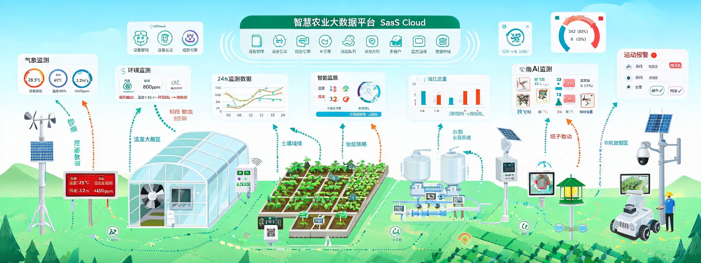
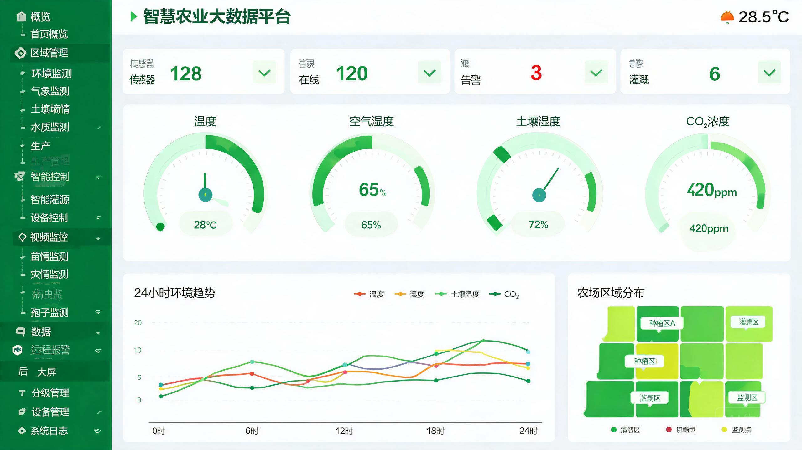
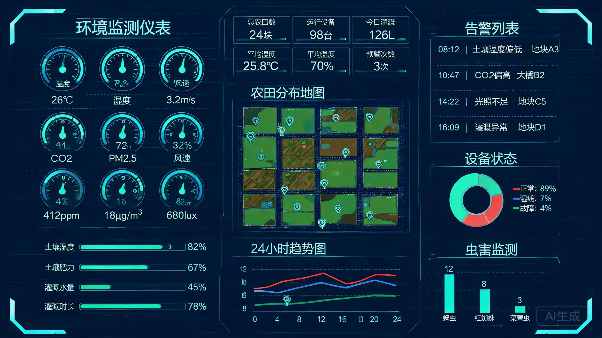
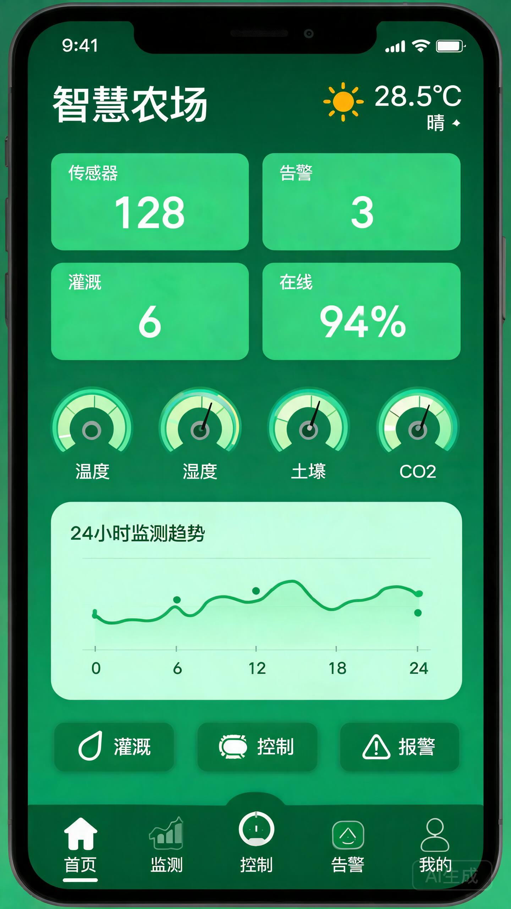
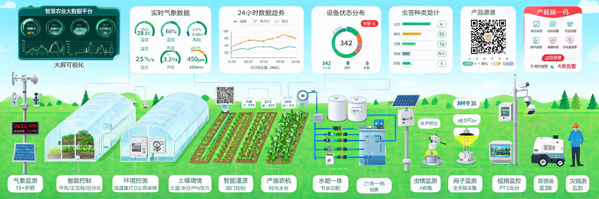
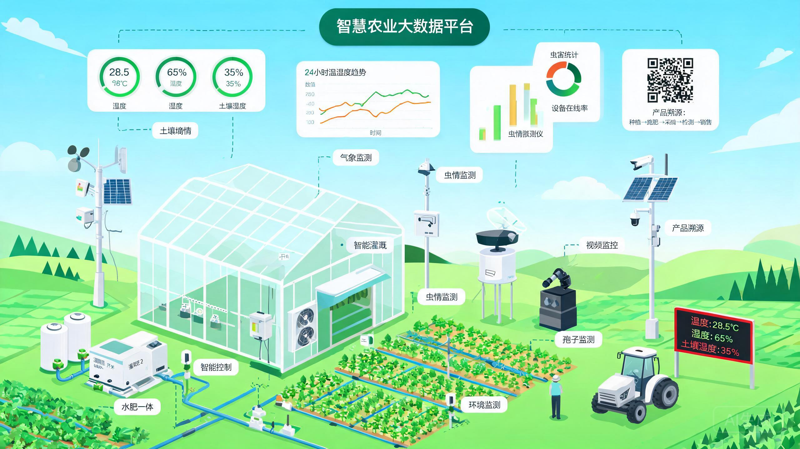

<p align="center">
  
  
  
  
  
  
  
  
</p>

# Smart Farm System - 智慧农业大数据平台

> 基于 Spring Boot 3.2 + AI + IoT 的 **SaaS 级** 智慧农业大数据平台，支持多租户隔离、Kafka 削峰、读写分离、自动扩缩容，通过树莓派+ESP32 边缘节点采集多传感器数据，MQTT 协议上云，内置自动灌溉引擎、AI 病虫害识别、Drools 规则引擎和大屏可视化。

---

## 平台概览



系统采用 **多租户 + 边云协同** 架构，边缘侧（树莓派+ESP32）采集传感器数据，经 MQTT 上云后通过 Kafka 削峰异步落库，支持多农场、多租户并行接入，K8s 水平扩展 3~10 实例。

### 核心能力一览

| 能力 | 实现方案 | 说明 |
|------|---------|------|
| 多租户隔离 | MyBatis-Plus TenantLineInterceptor + `tenant_id` | 每租户独立管理农场/传感器/灌溉规则 |
| 消息削峰 | Kafka 3 分区 + 异步消费 | 传感器数据先入 Kafka 再落库 |
| 读写分离 | dynamic-datasource + MySQL 主从 | 读路由从库，写走主库 |
| 水平扩展 | K8s HPA + EMQX 共享订阅 | 3~10 Pod 自动扩缩容 |
| 限流防护 | Redis + AOP `@RateLimit` | 接口级限流 |
| 安全防护 | CORS + XSS 过滤 + JWT | JWT 携带租户上下文 |
| 监控运维 | Actuator + Prometheus + Grafana | P99 延迟、JVM 内存、传感器上报频率 |
| 边缘计算 | 树莓派网关 + ESP32 传感器节点 | 多协议采集、边缘预处理 |

---

## 前端可视化

平台包含 **5 个前端页面**，纯 HTML/CSS/JS 单文件，无需构建工具，浏览器直接打开。

### 1. PC 管理台（20 个功能模块）

<p align="center">
  <a href="frontend/index.html">
    
  </a>
</p>

侧边栏导航覆盖全部业务模块：

| 分组 | 模块 | 说明 |
|------|------|------|
| 概览 | 首页概览、区域管理 | 统计卡片、环形仪表、分区网格地图 |
| 环境监测 | 气象监测、土壤墒情、水质监测 | 15+气象参数、分层土壤剖面、水质 6 指标 |
| 生产 | 生产管理、产品溯源 | 9 维度 KPI、一物一码全流程追溯 |
| 智能控制 | 智能灌溉、设备控制 | 阀门地图、开关/正反转/百分比 |
| 视频监控 | 苗情监测、灾情监测、通用视频 | PTZ 云台、24h 录像、灾情响应 |
| 病虫害 | 虫情监测、孢子监测 | AI 识别红框、全天候孢子采集 |
| 数据 | 数据管理、远程报警 | 表格/曲线切换、4 类告警 + 邮件/短信 |
| 后台 | 大屏可视化、分级管理、设备管理、系统日志 | 三层金字塔权限、设备电池/信号 |

### 2. 大屏可视化

<p align="center">
  <a href="frontend/bigscreen.html">
    
  </a>
</p>

深蓝科技风全屏页面，三列 9 面板布局，自动轮显，农场分布地图 + 实时数据趋势 + 告警滚动列表。

### 3. 移动端 H5

<p align="center">
  <a href="frontend/mobile.html">
    
  </a>
</p>

底部 5 Tab 导航：首页（天气+统计+趋势图）、监测（气象/土壤/水质）、控制（灌溉/设备）、告警（4 类汇总）、我的。

### 4. 业务全景图

<p align="center">
  <a href="frontend/panorama.html">
    
  </a>
</p>

7 层架构全景：感知层 → 网络层 → 数据层 → 平台层 → 应用层 → 展示层 → 用户层。

### 5. 系统联动架构图

<p align="center">
  <a href="frontend/system-architecture.html">
    
  </a>
</p>

SVG 矢量图，展示设备↔区域↔平台的联动数据流，鼠标悬停查看详情。

---

## 边缘硬件架构

```
ESP32 传感器节点 (Arduino C++)
    ↓ MQTT (WiFi)
树莓派网关 (Python)
    ↓ MQTT (4G/WiFi)
EMQX Broker
    ↓ HTTP Auth
智慧农业云平台 (Spring Boot)
```

| 硬件 | 角色 | 代码 |
|------|------|------|
| ESP32 | 传感器节点，采集温湿度/土壤/光照/CO2 | [esp32_sensor_node.ino](scripts/esp32_sensor_node.ino) |
| 树莓派 | 边缘网关，协议转换、数据聚合、本地缓存 | [raspberry_pi_gateway.py](scripts/raspberry_pi_gateway.py) |

详见 [硬件配置文档](docs/hardware-setup.md)。

---

## 设备认证鉴权（MQTT per-device 身份验证）

采用 EMQX HTTP Auth 插件，每个传感器分配独立 `deviceSecret`。

| 端点 | 功能 | 说明 |
|------|------|------|
| `POST /api/mqtt/auth` | 身份认证 | 校验 `sensorCode + deviceSecret`，Redis 缓存 |
| `POST /api/mqtt/acl` | Topic 授权 | 设备仅能操作 `farm/sensor/{自身ID}/#` |

详见 [EMQX Auth 配置文档](docs/emqx-auth-setup.md)。

---

## OTA 固件升级

| 实体 | 说明 |
|------|------|
| `Firmware` | 固件版本管理（版本号/URL/MD5/SHA256/状态：DRAFT→PUBLISHED→DEPRECATED） |
| `OtaTask` | 升级任务（全量/按农场/指定设备，立即/定时） |
| `OtaDeviceProgress` | 设备级进度（PENDING→DOWNLOADING→INSTALLING→SUCCESS/FAILED） |

MQTT 下发通道：`farm/sensor/{sensorId}/ota/command`

---

## Drools 规则引擎

支持 `.drl` 规则文件动态加载、热重载、CRUD 管理。

**内置规则：**

| 规则 | 条件 | 级别 |
|------|------|------|
| 温度超限告警 | temperature > 40 | CRITICAL |
| 低电量告警 | battery < 20 | WARNING |
| 信号弱告警 | signal < -90 | INFO |
| 高温+干旱复合 | temperature > 35 && soilMoisture < 20 | CRITICAL |
| 土壤过湿 | soilMoisture > 80 | WARNING |

---

## 核心功能模块

| 模块 | Controller | 功能说明 |
|------|-----------|---------|
| 农场管理 | `FarmController` | 农场/地块 CRUD，区域规划 |
| 传感器监测 | `SensorController` | 实时数据、历史曲线、表格/曲线切换 |
| 告警管理 | `AlarmController` | 4 类告警（离线/超限/差值/低电量），邮件+短信通知 |
| 智能灌溉 | `IrrigationController` | 远程/定时/智能三种模式，水肥一体控制 |
| 病害识别 | `DiseaseController` | AI 病虫害识别，图片上传+检测结果 |
| 仪表盘 | `DashboardController` | 全局统计、趋势图、分区状态 |
| MQTT 认证 | `MqttAuthController` | EMQX HTTP Auth 回调 |
| OTA 升级 | `OtaController` | 固件管理、升级任务、进度追踪 |
| 规则管理 | `RuleController` | Drools 规则 CRUD、热重载、试跑 |

---

## 技术栈

| 层级 | 技术 | 版本 |
|------|------|------|
| 基础框架 | Spring Boot | 3.2.5 |
| 开发语言 | Java | 17 |
| ORM | MyBatis-Plus | 3.5.7 |
| 消息队列 | Spring Kafka | 3.x |
| 缓存/限流 | Spring Data Redis | 3.2.5 |
| 时序数据库 | InfluxDB | 7.2.0 |
| MQTT 客户端 | Eclipse Paho | 1.2.5 |
| API 文档 | Knife4j (OpenAPI3) | 4.4.0 |
| 规则引擎 | Drools | 8.44.0.Final |
| 读写分离 | dynamic-datasource | 4.3.1 |
| JWT 认证 | JJWT | 0.12.6 |
| 监控 | Micrometer + Prometheus | - |
| 边缘节点 | ESP32 (Arduino) + 树莓派 (Python) | - |
| 部署 | Docker + Kubernetes + GitHub Actions | - |

---

## 快速启动

### 前置依赖

```bash
docker run -d --name mysql -p 3306:3306 -e MYSQL_ROOT_PASSWORD=root mysql:8
docker run -d --name redis -p 6379:6379 redis:7
docker run -d --name emqx -p 1883:1883 -p 18083:18083 emqx/emqx:5
docker run -d --name kafka -p 9092:9092 -e KAFKA_ADVERTISED_LISTENERS=PLAINTEXT://localhost:9092 confluentinc/cp-kafka:latest
docker run -d --name influxdb -p 8086:8086 influxdb:2
```

### 初始化数据库

```bash
mysql -u root -p < src/main/resources/sql/init.sql
```

### 启动后端

```bash
git clone https://github.com/YuanYunYang/smart-farm-system.git
cd smart-farm-system
mvn spring-boot:run
```

### 访问

| 服务 | 地址 |
|------|------|
| 后端 API | http://localhost:8080 |
| API 文档 (Knife4j) | http://localhost:8080/doc.html |
| PC 管理台 | http://localhost:8080/frontend/index.html |
| 大屏可视化 | http://localhost:8080/frontend/bigscreen.html |
| 移动端 H5 | http://localhost:8080/frontend/mobile.html |
| 业务全景图 | http://localhost:8080/frontend/panorama.html |
| 系统联动架构图 | http://localhost:8080/frontend/system-architecture.html |

---

## 生产部署

### Docker

```bash
docker build -t smart-farm:1.0 .
docker run -d -p 8080:8080 \
  -e SPRING_PROFILES_ACTIVE=prod \
  -e MYSQL_HOST=mysql-host \
  -e REDIS_HOST=redis-host \
  -e KAFKA_SERVERS=kafka:9092 \
  -e EMQX_HOST=emqx-host \
  smart-farm:1.0
```

### Kubernetes

```bash
kubectl apply -f k8s/deployment.yaml
# 含 HPA (3~10 Pod)、Ingress、Secret、ConfigMap
```

---

## MQTT Topic 规划

| Topic | 方向 | 说明 |
|-------|------|------|
| `farm/sensor/{sensorId}/data` | 设备→平台 | 传感器数据上报 |
| `farm/sensor/{sensorId}/command` | 平台→设备 | 控制指令下发 |
| `farm/sensor/{sensorId}/alarm` | 设备→平台 | 告警事件上报 |
| `farm/sensor/{sensorId}/ota/command` | 平台→设备 | OTA 升级指令 |
| `farm/sensor/{sensorId}/ota/progress` | 设备→平台 | OTA 进度上报 |
| `farm/sensor/{sensorId}/heartbeat` | 设备→平台 | 心跳上报 |

---

## 自动灌溉规则示例

```json
{
  "ruleName": "土壤干旱自动灌溉",
  "condition": "soilMoisture < 25",
  "action": "OPEN_VALVE",
  "duration": 30,
  "fieldId": 1,
  "enabled": true
}
```

| 模式 | 说明 |
|------|------|
| 远程手动 | 手动开/关阀门 |
| 定时控制 | 按时间表自动执行 |
| 智能策略 | 根据土壤湿度/气象数据自动触发 |

---

## 项目结构

```
smart-farm-system/
├── src/main/java/com/farm/smart/
│   ├── SmartFarmApplication.java             # 启动类
│   ├── ai/                                    # AI 模块
│   │   └── DiseaseAiClient.java              # 病虫害 AI 识别客户端
│   ├── common/                                # 公共模块 (7)
│   │   ├── GlobalExceptionHandler.java
│   │   ├── BusinessException.java
│   │   ├── JwtUtils.java
│   │   ├── RateLimit.java + RateLimitAspect.java
│   │   ├── Result.java + ResultCode.java
│   ├── config/                                # 配置模块 (13)
│   │   ├── MqttConfig / KafkaConfig / DroolsConfig
│   │   ├── MybatisPlusConfig (多租户)
│   │   ├── CorsConfig / XssFilter / RedisConfig
│   │   ├── InfluxDbConfig / WebSocketConfig
│   │   └── ...
│   ├── controller/                             # 控制器 (11)
│   ├── kafka/                                  # Kafka 消费者
│   ├── model/
│   │   ├── dto/                                # 请求对象 (10)
│   │   ├── entity/                             # 实体 (13)
│   │   ├── enums/                              # 枚举 (4)
│   │   └── vo/                                 # 响应对象 (5)
│   ├── mqtt/                                   # MQTT 模块 (3)
│   ├── repository/                             # Mapper 接口 (13)
│   ├── schedule/                               # 定时任务 (2)
│   │   ├── DataAggregationTask.java             # 数据聚合
│   │   └── IrrigationScheduleTask.java         # 灌溉调度
│   ├── service/                                # 服务接口 (11)
│   │   └── impl/                               # 服务实现 (11)
│   ├── tenant/                                 # 多租户 (2)
│   └── websocket/                              # WebSocket 推送
├── src/main/resources/
│   ├── application.yml
│   ├── mapper/                                 # MyBatis XML (8)
│   ├── rules/default-alarm-rules.drl           # Drools 规则
│   └── sql/init.sql                            # 数据库初始化
├── frontend/                                   # 前端页面 (5 HTML + 4 JPG)
│   ├── index.html                              # PC 管理台 (20 模块)
│   ├── bigscreen.html                          # 大屏可视化
│   ├── mobile.html                             # 移动端 H5
│   ├── panorama.html                           # 业务全景图
│   ├── system-architecture.html                # 系统联动架构图
│   ├── smart-farm-pano-hd.jpg                  # 高清农场全景图
│   └── ...
├── scripts/                                    # 边缘硬件代码
│   ├── esp32_sensor_node.ino                   # ESP32 传感器节点
│   └── raspberry_pi_gateway.py                # 树莓派网关
├── docs/                                       # 文档
│   ├── architecture.md
│   ├── hardware-setup.md
│   └── emqx-auth-setup.md
├── k8s/deployment.yaml                         # K8s 部署
├── monitoring/prometheus.yml                   # Prometheus 监控
├── Dockerfile                                  # Docker 构建
├── docker-compose-prod.yml                     # 生产编排
└── pom.xml
```

---

## 贡献

欢迎提交 Issue 和 PR。请确保代码通过 `mvn compile` 编译验证。

## License

MIT License